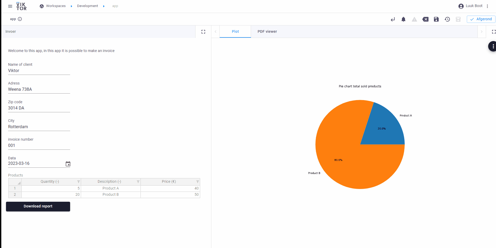
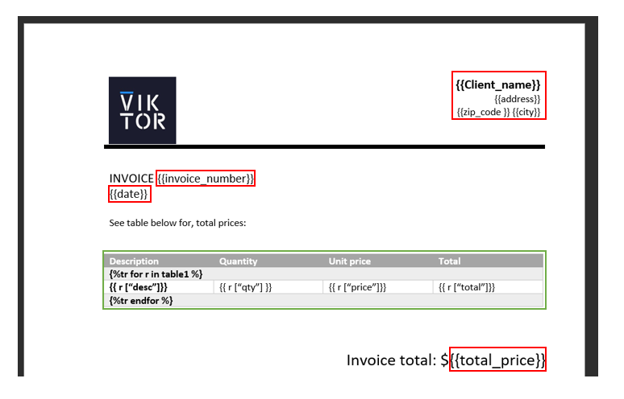
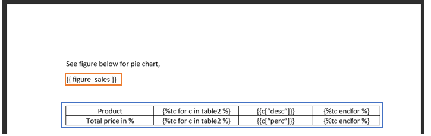

# Tuturial automatic reporting 
Welcome to this tutorial on automatic reporting in Viktor with python! As an engineer or data scientist, generating reports is an essential part of your work. Reporting not only helps you understand the insights from your data but also helps you communicate your findings/results to stakeholders.

In this tutorial, we will explore how to automate the process of generating reports in Viktor with python. We will cover the basics of automatic report generation, including text, figures and dynamic tables.

We will also learn how to use Jinja2, a templating engine for Python, a library for creating PDF documents, to generate professional-looking reports with minimal effort.

By the end of this tutorial, you will have created a simple viktor application that makes an invoice with a pie chart. See gif below:



## 1. Starting structure of application
Weet niet wat hier moet staan 


## 2. Adding download button
The first step is to add a donwload button, the download enables the user to download a file to hard disk upon clicking a button. The following steps needs to be taken:

1. Add a Downloadbutton in the parametrization class of the corresponding entity type
2. Add the download method on the corresponding controller class of the enity type to link the DownloadButton, and return the file(word document) as DownloadResult

See code below:

```
from viktor import ViktorController
from viktor.parametrization import ViktorParametrization, Downloadbutton
from viktor.result import DownloadResult

class Parametrization(ViktorParametrization):
    download_word_file = DownloadButton('Download report', method='download_word_wile')
    
class Controller(ViktorController):
    viktor_enforce_field_constraints = True 

    label = 'My Entity Type'
    parametrization = Parametrization

    def download_word_file(self, params, **kwargs):
        ...
        word_file = render_word_file(...)
        return DownloadResult(word_file,"{name_file}.docx")
```

## 3. Creating a simple plate 
The next step is to make a simple template in word, the word template is made with the Jinja notation. The word template in this example will have 2 different pages, on the first page the general information of the invoice will be displayed and a table with dynamic rows, with the following columns; product description, quantity, single price of the product and total price of the product. On the second page, a pie chart will be shown, which will be made in the Viktor app and a table with dynamic columns to show the percentage of the total price.

Page 1:


Page 2:



### 3.1 Text/Figure tags 
The text tags and figure tags are both noted with the {{ }} delimiter, see the red boxes for the text tags and the orange box for the figure tags. The string inside the delimiters is called the indetifier and is used to place the right values at the right tags.

### 3.2 Table with dynamic rows 
The first table(green box) is a table with dynamic rows, this means that the number of rows depends on the input. When creating a table with dynamic rows follow the following steps:

1. Create a tabel in word with column headings and the right lay-out.
2. Add a row and merge the cells together
3. Fill in the following line of code: 
```

```
4. Add a row and split the cells into the columns 
5. Fill in the following line of code in each column, where var is the key name of the value.
```
{{r[var]}}
```
6. Add a row and merge the cells together and add the following line of code to close the for loop:
```

```
### 3.3 Table with dynamic columns 
The table on the second page is a table with dynamic columns. When creating a table with dynamic colums the following needs to be followed:

1. Create a tabel in word with four columns and the number of rows the tabels needs to be
2. In the first column add the row headings
3. In the second column add the following line of code:
```

```
4. In the third columnd add the following line of code, where var is the key name of the value 
```
{{c[var]}}
```
5. In the fourth coloumn add:
```

```

## 4. Adding field in paramatrization to use

The next is to add inputfields in the paramatrization to fill in the variables for the word template. We will use linebreak and Text for the layout and Table, TextField, NumberField and DateField as inputfields. See code below:


```
from viktor import ViktorController
from viktor.parametrization import ViktorParametrization, DownloadButton, NumberField, Table, TextField, DateField , Text, LineBreak


class Parametrization(ViktorParametrization):
    txt1 = Text("Welcome to this app, in this app it is possible to make an invoice")
    # Adding fields 
    client_name = TextField("Name of client")
    lb1 = LineBreak()
    adress = TextField("Adress")
    lb2 = LineBreak()
    zip_code = TextField("Zip code")
    lb3 = LineBreak()
    city = TextField("City")
    lb4 = LineBreak()
    invoice_number = TextField("invoice number")
    lb5 = LineBreak()
    date = DateField("Data")

    # Table
    table_price = Table("Products")
    table_price.qty = NumberField("Quantity", suffix="-")
    table_price.desc = TextField("Description", suffix="-")
    table_price.price = NumberField("Price", suffix="€")

    download_word_file = DownloadButton('Download report', method='download_word_file')
```

To generate the word document we will create a function called "generate_word_file", see next chapter. Firstly we import the parameters from the table in a pandas Dataframe and add two columns for the total price and the percentage of the total price. 

Secondly we create a function to make a matploblib pie chart with the dataframe, this function also stores the figure in the following location: "files/figure.png"

In the "download_word_file" method we add the following lines of code:

```
The next step is to import the necessary packagess and to add an array called " compomentens", you can give this array any name you want. All tags are stored in this array and eventually with the render_word_file function the final word document is made.


```


def download_word_file(self, params, **kwargs):
    # Generating a panda dataframe from the price table 
    df_price = pd.DataFrame.from_dict(params.table_price) 

    total = []
    for i in df_price.index:
        qty = df_price.loc[i, "qty"]
        price = df_price.loc[i, "price"]
        total.append(qty*price)
    
    total_price = np.sum(total) # Calculating total price
    
    df_price["total"] = total # Adding total price column to dataframe

    perc_total = []
    for i in df_price.index:
        total = df_price.loc[i, "total"]
        calc = round((total/ total_price)*100,2)
        perc_total.append(str(calc)+"%")
    df_price["perc"] = perc_total # adding percentage column to dataframe

    figure = create_figure(df_price)
    word_file = generate_word_document(client_name = params.client_name,
                                        adress = params.adress,
                                        zip_code = params.zip_code,
                                        city = params.city,
                                        invoice_number = params.invoice_number,
                                        df_price = df_price,
                                        total_price = total_price
                                        )

    return DownloadResult(word_file,"test.docx")
```

## 5. Define text and image tags with VIKTOR objects
Inside the function:"generate_word_document", create an empty array called components. In this array we will store all tags, to finally generate the word document.
### 5.1 Text tags
To give the tags in the word document values, the WordFileTag function is used. The function has two agruments, the first argument is the indentifier this used to find the location in the word template. The second argument what is the value that need to be placed at the tag location. See code below for example

```
from viktor.external.word import WordFileImage, WordFileTag, render_word_file

def generate_word_document(client_name,
                           adress,
                           zip_code,
                           city,
                           invoice_number,
                           date,
                           df_price,
                           total_price
                           ):
    components = []
    # Text tags 
    components.append(WordFileTag("Client_name", client_name))
    components.append(WordFileTag("address", adress))
    components.append(WordFileTag("zip_code", zip_code))
    components.append(WordFileTag("city", city))
    components.append(WordFileTag("INVOICE_NUMBER", invoice_number))
    components.append(WordFileTag("total_price", str(total_price))) # Convert float to string
```
### 5.2 Tables 
The WordFileTag values can also be of type list or dict, to make it possible to iteratie within the template. This is used for the tables, to give Table1 two rows. The data needs to be formatted as below. 

```
data_table2 =[
    {"desc": "A", "qty": 10, "price": 5, "total":50 },
    {"desc": "B", "qty": 20, "price": 3, "total":60 }
]

```

See code below for the making of the table, the first step is to change the dataframe in the right format. With the help of the WordFileTag the tables will be made. 
```
# Change format of the dataframe
df_price = df_price.to_dict("records")

components.append(WordFileTag('table1', df_price))
components.append(WordFileTag("table2", df_price))

```

### 5.3 Image
An image can be inserted using the WordFileImage object which requres a binary file handle. The function "create_figure" stores a png image in the following lcoation: "files/figure.png". With the pathlib it is possible to open this file and place it in the word document. See code below:

```
from pathlib import Path

figure_path = Path(__file__).parent "files" / "figure.png"png'
with open(figure_path, 'rb') as image:
    word_file_image = WordFileImage(figure, 'figure_sales', width = 500)

components.append(word_file_image)

```

### 5.4 Render word file
Now that all the Word file components are defined, the Word file can be rendered using render_word_file. The word template is stored in the files folder. WIth the following code the word file is rendered:
```
template_path = Path(__file__).parent /"files" / "Template.docx"
with open(template_path, 'rb') as template:
    word_file = render_word_file(template, components)
```

### 5.5 generate_word_document
See code below for the total code in the generate_word_document function

```
def generate_word_document(client_name,
                           adress,
                           zip_code,
                           city,
                           invoice_number,
                           date,
                           df_price,
                           total_price
                           ):
    components = []
    # Text tags 
    components.append(WordFileTag("Client_name", client_name))
    components.append(WordFileTag("address", adress))
    components.append(WordFileTag("zip_code", zip_code))
    components.append(WordFileTag("city", city))
    components.append(WordFileTag("date", date))
    components.append(WordFileTag("invoice_number", invoice_number))
    components.append(WordFileTag("total_price", str(total_price)))

    # Dynamic tables
    df_price = df_price.to_dict("records")
    components.append(WordFileTag('table1', df_price))
    components.append(WordFileTag("table2", df_price))

    # Figure 
    figure_path = Path(__file__).parent / "files" / "figure.png"
    with open(figure_path, "rb") as figure:
        word_file_figure = WordFileImage(figure, "figure_sales", width = 500)

    components.append(word_file_figure)

    template_path = Path(__file__).parent /"files" / "Template.docx"
    with open(template_path, 'rb') as template:
        word_file = render_word_file(template, components)
    
    return word_file
```


# 6. Generate pdf view
In viktor it is possible to show a pdf view. Follow the next steps:
1. Create a PDFVIEW method inside the controller class
2. Import dataframe and transform the dateframe(same as in the downloadbutton method)
3. Create figure with the "create_figure" function 
4. Generate word file with the "generate_word_document" function 
5. covert word to pdf, with the conver_word_to_pdf function 

See code below for the pdfview method:
```
@PDFView("PDF viewer", duration_guess=5)  
def pdf_view(self, params, **kwargs):
    df_price = pd.DataFrame.from_dict(params.table_price) 

    total = []
    for i in df_price.index:
        qty = df_price.loc[i, "qty"]
        price = df_price.loc[i, "price"]
        total.append(qty*price)
    
    total_price = np.sum(total) # Calculating total price
    
    df_price["total"] = total # Adding total price column to dataframe

    perc_total = []
    for i in df_price.index:
        total = df_price.loc[i, "total"]
        calc = round((total/ total_price)*100,2)
        perc_total.append(str(calc)+"%")
    df_price["perc"] = perc_total # adding percentage column to dataframe

    figure = create_figure(df_price)
    word_file = generate_word_document(client_name = params.client_name,
                                        adress = params.adress,
                                        zip_code = params.zip_code,
                                        city = params.city,
                                        date = str(params.date),
                                        invoice_number = params.invoice_number,
                                        df_price = df_price,
                                        total_price = total_price
                                        )
                                        
    with word_file.open_binary() as f1:
        pdf_file = convert_word_to_pdf(f1)


    return PDFResult(file = pdf_file)
```


